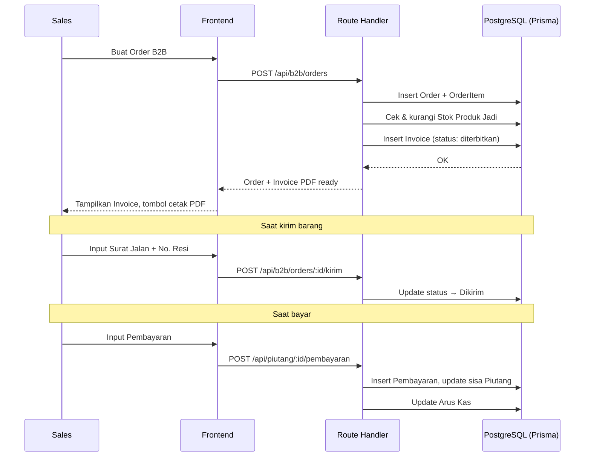
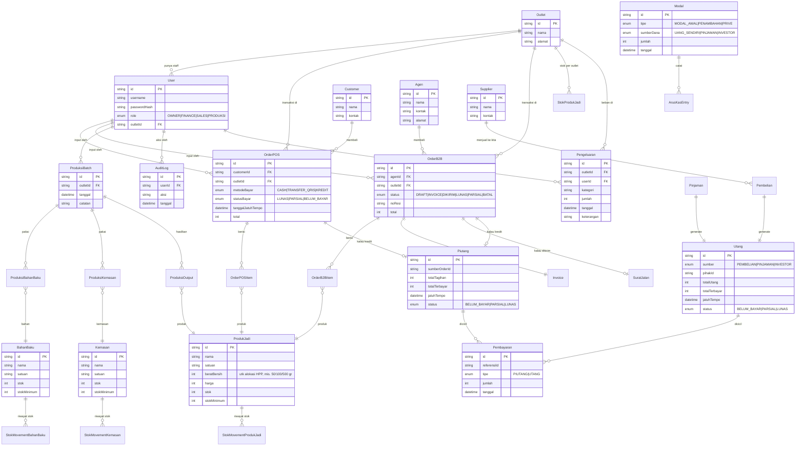

# PRD — Gampangin FNB

## 1. Overview

Gampangin FNB adalah aplikasi manajemen operasional internal untuk bisnis Food & Beverage milik Rizky, mencakup penjualan POS (retail/konsumen langsung) dan B2B (ke Agen/Distributor), produksi, inventory (bahan baku, kemasan, produk jadi), utang-piutang, serta modul keuangan dasar (modal, arus kas, laba rugi, neraca). Digunakan oleh 4 role: Owner, Finance, Sales, dan Produksi, lintas beberapa outlet/cabang dalam satu brand. Tujuan utama: mengganti pencatatan manual dengan satu sistem terpusat yang memberi visibilitas real-time atas penjualan, stok, dan kondisi keuangan.

---

## 2. Requirements

- **Aksesibilitas:** Web, wajib mobile-friendly (PWA) — Sales & Produksi banyak input dari HP di lapangan/dapur.
- **Pengguna:** 4 role — OWNER, FINANCE, SALES, PRODUKSI (lihat §7 untuk detail akses).
- **Auth:** Username & Password (iron-session), tanpa Google OAuth. Akun dibuat oleh Owner lewat User Management.
- **Multi-outlet:** Satu brand, banyak outlet/cabang. Transaksi, stok, dan laporan bisa difilter per outlet.
- **Data Input:** Manual entry, import (CSV) untuk Database (Bahan Baku/Kemasan/Produk/Customer/Agen/Supplier), dan auto-entry dari transaksi (customer/agen baru otomatis masuk Database saat transaksi pertama).
- **Export:** Excel & PDF untuk laporan keuangan; PDF untuk cetak Invoice B2B.
- **Constraint khusus:** Bukan pembukuan akuntansi penuh (tanpa jurnal umum/double-entry formal) — Laba Rugi, Arus Kas, dan Neraca dihitung secara agregat dari transaksi (lihat §7 Business Logic).

---

## 3. Core Features

### 3.1 Dashboard (Must-have)
Ringkasan bisnis, konten berbeda per role:
- **Owner/Finance:** Omzet hari ini/bulan ini (breakdown POS vs B2B), grafik penjualan mingguan/bulanan, saldo kas saat ini, Piutang jatuh tempo & overdue (>30 hari, ditandai merah), Utang jatuh tempo & overdue (>30 hari), Top 5 Agen/Distributor terbaik (by omzet), Top produk terlaris, stok menipis (bahan baku/kemasan/produk di bawah ambang batas).
- **Sales:** Omzet penjualan sendiri, order pending, piutang customer/agen yang dia pegang.
- **Produksi:** Batch produksi terakhir + waste %, stok bahan baku & kemasan menipis.
- Filter per outlet (untuk Owner/Finance yang lihat semua outlet).

### 3.2 POS (Retail) — dulu disebut "Retail" (Must-have)
- Order langsung ke konsumen akhir (Customer).
- Metode pembayaran: **Cash** (default), **Transfer/QRIS**, **Kredit** (Langsung Lunas / Parsial + tanggal jatuh tempo).
- Kredit Parsial dicatat sebagai cicilan (multiple pembayaran) sampai lunas, riwayat tersimpan.
- Stok Produk Jadi otomatis berkurang saat order dibuat.
- Customer baru otomatis masuk Database (kalau belum ada).

### 3.3 B2B (Business) — dulu disebut "Bussiness" (Must-have)
- Order ke **Agen/Distributor**.
- Alur: Order dibuat → **Invoice diterbitkan (cetak PDF)** → barang **dikirim** (dicatat pakai **Surat Jalan** + **No. Resi**) → **Payment**.
- Payment bisa **di muka** atau **belakangan** (mayoritas setelah kirim) — juga bisa Kredit (Langsung Lunas/Parsial + jatuh tempo) sama seperti POS.
- Status order: Draft → Invoice Diterbitkan → Dikirim → Parsial/Lunas → (Batal, jika perlu).
- Agen baru otomatis masuk Database (kalau belum ada).

### 3.4 Utang & Piutang (Must-have)
- 1 halaman, **2 tab**: **Tab Utang**, **Tab Piutang** (data terpisah, tidak dicampur).
- **Piutang**: otomatis ter-generate dari transaksi POS & B2B yang Kredit (belum lunas).
- **Utang**: dari pembelian Bahan Baku/Kemasan ke Supplier, Pinjaman, dan Investor.
- Filter: status (Belum Bayar/Parsial/Lunas), jatuh tempo, pihak (customer/agen/supplier), outlet, tanggal.
- Riwayat cicilan/pembayaran per item Utang/Piutang.

### 3.5 Database (Must-have)
Master data, masing-masing bisa diisi lewat **Import (CSV)**, **Entry manual**, atau **otomatis dari transaksi**:
- Bahan Baku
- Produk Jadi
- Kemasan
- Customer (pembeli POS)
- **Agen** (pembeli B2B/distributor — pisah dari Supplier)
- **Supplier** (pemasok bahan baku/kemasan — pisah dari Agen)

### 3.6 Proses Produksi (Must-have)
- Input **manual tiap batch produksi** (tanpa resep/BOM tetap).
- Masukkan Bahan Baku yang dipakai (bisa lebih dari satu).
- Output: **bisa beberapa Produk Jadi berbeda** dalam satu batch, masing-masing dengan qty.
- Kemasan yang dipakai (botol, dll) ikut dicatat & stoknya berkurang.
- Ada field **waste/susut** (bahan terbuang, opsional per bahan).
- Stok Bahan Baku & Kemasan otomatis berkurang, stok Produk Jadi otomatis bertambah, saat batch disimpan.

### 3.7 Inventory (Must-have)
- 3 ledger stok terpisah: **Produk Jadi**, **Bahan Baku**, **Kemasan**.
- Riwayat pergerakan stok (in/out) dengan referensi sumber (pembelian, produksi, penjualan, adjustment manual, waste).
- Stok per outlet.
- Alert stok menipis (ambang batas per item).

### 3.8 Finance Room (role Finance, Must-have)
Bagian khusus, akses terbatas ke role FINANCE (dan OWNER):
- **Modal**: Modal Awal, Penambahan Modal (Uang Sendiri / Pinjaman / Investor), **Prive** (penarikan pribadi Owner).
- **Arus Kas (Cash Flow)**: agregat dari penjualan, pembelian, pembayaran utang/piutang, modal masuk, dan prive — mempengaruhi saldo kas saat ini.
- **Laba Rugi (P&L)**: Penjualan − HPP (dari biaya produksi: bahan baku + kemasan terpakai) − Beban Operasional (jika dicatat).
- **Neraca (Balance Sheet)**: Aset (Kas + Piutang + Nilai Stok) vs Kewajiban (Utang) + Modal (Modal Awal + Penambahan − Prive + Laba Ditahan).
- Export laporan ke Excel/PDF.

### 3.9 Pengeluaran / Beban Operasional (role Finance, Must-have)
- Catat beban operasional di luar pembelian bahan baku/kemasan: gaji, sewa, listrik & air, transportasi, marketing, lain-lain.
- Field: kategori (dropdown searchable, bisa tambah kategori baru), jumlah, tanggal, outlet, keterangan, dicatat oleh siapa.
- Masuk sebagai **Beban Operasional** di Laba Rugi, dan sebagai cash-out di Arus Kas.
- Filter per kategori, periode, outlet. Export Excel/PDF.

### 3.10 Report (Must-have)
- Laporan Laba Rugi, Arus Kas, Neraca (lihat §3.8), bisa difilter per periode & outlet, export Excel/PDF.
- Laporan penjualan (POS/B2B), laporan piutang jatuh tempo, laporan stok, laporan pengeluaran.

### 3.11 Panduan (Must-have)
- Halaman panduan penggunaan app, berurutan seperti **quick start guide**.
- Berisi contoh-contoh latihan entry data (data dummy/latihan) supaya user baru bisa praktik langsung tanpa takut mengotori data asli.

### 3.12 Owner Room (role Owner only, Must-have)
- **Pengaturan Toko**: nama toko/brand, logo, kelola daftar outlet/cabang.
- **User Management**: kelola akun & role staff.
- **Audit Log**: riwayat aktivitas penting (siapa ubah apa, kapan).
- **Reset Data**: menghapus semua data transaksi (untuk keluar dari mode trial ke data bersih). **Wajib konfirmasi ganda** — user harus mengetik `RESET ASLI` atau `HAPUS ASLI` untuk eksekusi. Hanya OWNER yang bisa akses.

---

## 4. User Flow

### Flow: Penjualan POS
1. Sales buka menu POS, pilih/entry Customer (searchable, atau buat baru inline).
2. Tambah produk dari Produk Jadi (stok tervalidasi).
3. Pilih metode bayar: Cash / Transfer-QRIS / Kredit (Langsung Lunas / Parsial + tanggal jatuh tempo).
4. Simpan → stok Produk Jadi berkurang, kalau Kredit → masuk ke Piutang.

### Flow: Penjualan B2B
1. Sales buat Order untuk Agen (searchable, atau buat baru inline).
2. Sistem generate Invoice (PDF, bisa dicetak).
3. Saat barang dikirim, input Surat Jalan + No. Resi → status jadi "Dikirim".
4. Payment dicatat (bisa sebagian di muka, sisanya setelah kirim) — kalau belum lunas, tercatat di Piutang dengan tanggal jatuh tempo.

### Flow: Produksi
1. Produksi buka menu Proses Produksi, buat batch baru.
2. Pilih Bahan Baku yang dipakai + jumlah (bisa lebih dari satu bahan).
3. Input waste/susut per bahan (opsional).
4. Input Produk Jadi hasil (bisa lebih dari satu jenis produk) + qty masing-masing.
5. Pilih Kemasan yang dipakai + jumlah.
6. Simpan → stok Bahan Baku & Kemasan berkurang, stok Produk Jadi bertambah.

### Flow: Pembayaran Utang/Piutang
1. Buka halaman Utang & Piutang, pilih tab yang sesuai.
2. Pilih item yang mau dibayar/ditagih, input jumlah pembayaran (bisa parsial/cicilan).
3. Riwayat pembayaran tersimpan per item, status update otomatis (Belum Bayar/Parsial/Lunas).

### Edge Cases
- Stok Bahan Baku/Kemasan tidak cukup saat input produksi → tampilkan error, blok simpan.
- Stok Produk Jadi tidak cukup saat order POS/B2B → tampilkan error, blok simpan (atau opsi override oleh Owner — dikonfirmasi saat implementasi).
- Reset Data dijalankan tanpa mengetik konfirmasi yang benar → gagal, tidak ada perubahan.
- Customer/Agen/Supplier dengan nama sama saat auto-create dari transaksi → sistem cek duplikat dulu, tawarkan pilih yang sudah ada.
- Piutang/Utang lewat jatuh tempo → otomatis muncul di Dashboard & ditandai (>30 hari = highlight khusus).

---

## 5. Architecture

---

## 6. Database Schema

| Tabel | Fungsi |
|-------|--------|
| User | Akun staff + role (OWNER/FINANCE/SALES/PRODUKSI) |
| Outlet | Daftar cabang/outlet dalam 1 brand |
| Customer | Pembeli POS (retail) |
| Agen | Pembeli B2B (distributor/reseller) — terpisah dari Supplier |
| Supplier | Pemasok Bahan Baku/Kemasan — terpisah dari Agen |
| BahanBaku / Kemasan / ProdukJadi | Master data + stok berjalan |
| OrderPOS / OrderPOSItem | Transaksi retail |
| OrderB2B / OrderB2BItem / Invoice / SuratJalan | Transaksi B2B lengkap dengan invoice & pengiriman |
| Piutang | Tagihan ke Customer/Agen (dari transaksi kredit) |
| Utang | Kewajiban ke Supplier/Pinjaman/Investor |
| Pembayaran | Riwayat cicilan, untuk Piutang maupun Utang |
| ProduksiBatch / ProduksiBahanBaku / ProduksiKemasan / ProduksiOutput | Catatan produksi manual per batch, multi-input multi-output |
| StokMovement* | Riwayat pergerakan stok (in/out) per jenis item |
| Modal | Modal Awal, Penambahan Modal, Prive — dasar Arus Kas & Neraca |
| Pengeluaran | Beban operasional (gaji, sewa, listrik, dll) — masuk Laba Rugi & Arus Kas |
| AuditLog | Jejak aktivitas untuk Owner Room |

---

## 7. Design & Technical Constraints

### Tech Stack
- **Frontend:** Next.js 16 (App Router) + React 19 + TypeScript
- **Backend:** Next.js Route Handlers
- **ORM:** Prisma 7 + `@prisma/adapter-pg`
- **Database:** PostgreSQL
- **Auth:** iron-session 8 (username + password), role dibaca fresh dari DB tiap request
- **UI:** Tailwind v4, Radix UI, cmdk (searchable dropdown), lucide-react, sonner
- **PWA:** manifest + service worker dasar untuk instalasi di HP (Sales/Produksi)
- **Deploy:** EasyPanel, domain `fnb.gampangin.biz.id`

### UI System
- Tema **light + dark**, ikut sistem OS by default, bisa di-override manual. Anti-FOUC script wajib.
- Kontras WCAG AA di semua teks.
- Semua dropdown pilihan pakai `SearchableSelect` (Customer, Agen, Supplier, Produk, Bahan Baku, Kemasan, Outlet, dll) — tanpa terkecuali, termasuk yang opsinya sedikit.
- Mobile-first, dicek di 375px (form order, input produksi harus nyaman dipakai dari HP).

### Naming Convention
- Label UI & field bisnis: Bahasa Indonesia (Piutang, Utang, Produksi, Kemasan, dst).
- Istilah yang sudah baku tetap Inggris: Dashboard, Invoice, Export, Import.
- Fungsi/variabel/komponen: camelCase/PascalCase. API routes: kebab-case. Enum: UPPER_SNAKE_CASE.
- Format angka: `Rp 1.250.000` (tanpa desimal). Tanggal: `20 Agu 2026`. Timezone WIB, simpan UTC di DB.

### Business Logic Hardcoded (perlu approval eksplisit Rizky sebelum implementasi)
1. **Laba Rugi** = Total Penjualan (POS+B2B) − HPP (biaya Bahan Baku+Kemasan terpakai per batch Produksi, dialokasikan ke Produk Jadi yang dihasilkan) − Beban Operasional (kalau dicatat manual).
2. **Neraca** = Aset (Kas + Piutang belum lunas + Nilai stok saat ini) vs Kewajiban (Utang belum lunas) + Modal (Modal Awal + Penambahan Modal − Prive + Laba Ditahan berjalan). *Ini bukan pembukuan akuntansi formal (tanpa jurnal umum/double-entry) — cukup untuk gambaran kesehatan bisnis, bukan laporan pajak.*
3. **Arus Kas** = akumulasi dari: (+) penjualan lunas, (+) pembayaran piutang masuk, (+) modal masuk, (−) pembelian bahan baku/kemasan, (−) pembayaran utang keluar, (−) prive.
4. **Piutang >30 hari** dan **Utang >30 hari** dari tanggal jatuh tempo → ditandai overdue/highlight di Dashboard & halaman Utang-Piutang.
5. **HPP per Produk Jadi** dari batch dengan banyak output produk (beda ukuran/berat): dialokasikan **proporsional terhadap total berat/volume output**, bukan rata per jumlah botol — karena botol ukuran besar menyerap bahan baku lebih banyak. Tiap Produk Jadi punya field `beratBersih` (mis. 50gr/100gr/500gr).

   **Rumus:** `Total Berat Output (produk) = beratBersih × qtyOutput`, lalu `HPP per gram = Total Biaya Batch ÷ Total Berat Output Semua Produk`, lalu `HPP per unit produk = HPP per gram × beratBersih produk itu`.

   **Contoh** (Total Biaya Batch = Rp100.000, hasil: Chili Oil 50gr×10 botol, 100gr×20 botol, 500gr×10 botol):

   | Produk | Berat Bersih | Qty | Total Berat | Alokasi Biaya | HPP/Botol |
   |---|---|---|---|---|---|
   | Chili Oil 50gr | 50gr | 10 | 500gr | Rp6.667 | **Rp667** |
   | Chili Oil 100gr | 100gr | 20 | 2.000gr | Rp26.667 | **Rp1.333** |
   | Chili Oil 500gr | 500gr | 10 | 5.000gr | Rp66.667 | **Rp6.667** |
   | **Total** | | **40** | **7.500gr** | **Rp100.000** | |

   *(HPP/gram = 100.000 ÷ 7.500 = Rp13,33/gram. Kalau Produk Jadi tidak diisi `beratBersih`, fallback ke rata per qty seperti sebelumnya, dengan warning di UI supaya user tahu hasilnya kurang akurat.)*
6. **Pengeluaran/Beban Operasional** dicatat manual per transaksi (kategori + jumlah + tanggal) oleh Finance/Owner, langsung masuk pengurang Laba Rugi dan cash-out Arus Kas — tidak ada alokasi/depresiasi otomatis untuk versi awal.
7. **Reset Data**: hard-delete seluruh data transaksi (order, produksi, stok, keuangan, pengeluaran) kecuali master User/Outlet/Pengaturan. Wajib ketik `RESET ASLI` atau `HAPUS ASLI`, hanya OWNER.

### Role & Akses

| Modul | OWNER | FINANCE | SALES | PRODUKSI |
|---|---|---|---|---|
| Dashboard | Full | Full | Sales-only view | Produksi-only view |
| POS | ✓ | view | ✓ | – |
| B2B | ✓ | view | ✓ | – |
| Utang & Piutang | ✓ | ✓ | view (miliknya) | – |
| Database | ✓ | view | ✓ (Customer/Agen) | view (Bahan Baku/Kemasan) |
| Proses Produksi | ✓ | – | – | ✓ |
| Inventory | ✓ | view | view Produk | ✓ |
| Finance Room (Modal/Arus Kas/Laba Rugi/Neraca) | ✓ | ✓ | – | – |
| Pengeluaran | ✓ | ✓ | – | – |
| Report | ✓ | ✓ | – | – |
| Panduan | ✓ | ✓ | ✓ | ✓ |
| Owner Room (Pengaturan/User Mgmt/Audit Log/Reset Data) | ✓ | – | – | – |

### Constraint Lain
- Multi-outlet: semua entitas transaksi & stok terikat `outletId`; laporan bisa agregat semua outlet atau per outlet.
- Reset Data & User Management: OWNER-only, dengan audit log tercatat siapa yang melakukan.
- Import CSV: validasi baris gagal di-exclude dari proses, ditampilkan sebagai daftar error untuk diperbaiki user (bukan gagal total).

---

## Status Konfirmasi
- ✅ Order dengan stok kurang → **diblok**, tidak boleh dipaksa simpan.
- ✅ Alokasi HPP multi-output → **proporsional per berat/ukuran** (lihat §7 Business Logic poin 5).
- ✅ Beban Operasional → modul **Pengeluaran** ditambahkan (lihat §3.9).

Semua poin terbuka sebelumnya sudah dikonfirmasi Rizky. PRD ini siap jadi acuan implementasi.
